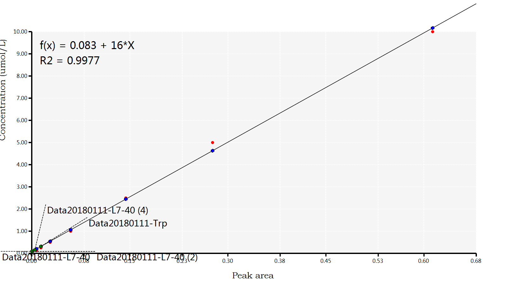

Compound database I/O provider and Mass Spectrum database I/O provider

## Visualize MRM Chromatogram Plots

```vbnet
Dim xlsx$ = "./ion-pairs.xlsx"
Dim ionPairs = Extensions.LoadIonPairs(xlsx, "ion pairs")

For Each file As String In ls - l - r - "*.mzML" <= directory
    Call ionPairs.Plot(file).AsGDIImage.SaveAs($"./{file.BaseName}.png")
Next
```

.png)
.png)
.png)


## MRM QuantitativeAnalysis

