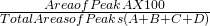

# How to Read a Chromatogram?

> http://lab-training.com/2013/12/27/how-to-read-a-chromatogram/

Over the years chromatography has gained an enviable position in analytical laboratories involving separation and quantification of organic compound mixtures. However, a chromatogram is not a display of results in concentration units but rather a graphical display in real time of peaks generated as the separated components pass through the detector.

The chromatogram makes little sense to the layman as the peaks provide no information on the identity of the mixture components nor any information on the amount present.

First of all it is necessary to understand what a chromatogram depicts. The chromatogram is a two-dimensional plot with the ordinate axis giving concentration in terms of detector response and the abscissa represents the time. The detector gives response as a peak whose height should be ideally dependent on concentration of the particular component.

 
> Retention Time (tr)

However, due to analysis conditions peaks may deviate from ideal shape and peak height can no longer be a true measure of the concentration and instead the area under the peak is considered as a measure of component concentration.

Each peak represents a component present in the sample. Retention time is time interval between sample injection and the maximum of the peak. It is characteristic of the identity of the component under the operating conditions. Identity of the component can be confirmed by making injections of reference material under the same operational conditions. The matching of retention time of reference material and the component peak confirms the identity of the unknown sample component.

Now let us consider a sample which contains more than one sample component. Likewise each component will be eluted at different retention times depending upon solute – stationary phase interactions and mobile phase flow characteristics.

 
> Calculation of results

From the area measurements using simple arithmetic it is simple to calculate the concentration of each component as a percent of the total.

## Real Chromatogram

Let us now look at the actual chromatogram printout of HPLC separation of a mixture of vitamins A and E in a food matrix and see what the chromatogram represents

> Actual Chromatogram

The ordinate is in units of volts and abscissa in minutes. The signals are recorded at a wavelength of 284 nm using a UV detector.

Retention time of each peak is marked above the peak and in the tabulated data below the chromatogram details of the retention time, area (as digital units), peak area%, height and height %. You can observe that due to non-ideal shape of peaks percentage area is different from percentage height for each component so area measurement is a more reliable measure of concentration.

You have been introduced to simple concepts on how to read a chromatogram. Please let us have your comments on the article and if you found it useful.