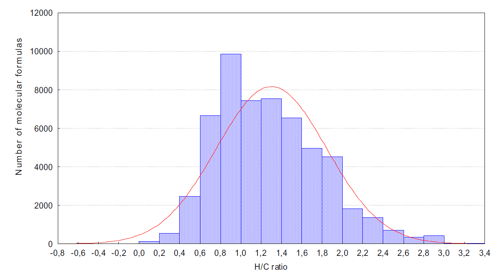

An algorithm for filtering molecular formulas is derived from seven heuristic rules: 

+ ``(1)`` restrictions for the number of elements, 
+ ``(2)`` LEWIS and SENIOR chemical rules, 
+ ``(3)`` isotopic patterns, 
+ ``(4)`` hydrogen/carbon ratios, 
+ ``(5)`` element ratio of nitrogen, oxygen, phosphor, and sulphur versus carbon, 
+ ``(6)`` element ratio probabilities and 
+ ``(7)`` presence of trimethylsilylated compounds.

> Seven Golden Rules for heuristic filtering of molecular formulas obtained by accurate mass spectrometry (``doi:10.1186/1471-2105-8-105``)

### Rule #1 – restrictions for element numbers

For developing this rule, the absolute element limits were calculated by simply dividing the mass range through the element mass (e.g. for ``carbon = 12 Da`` at 1000 Da follows ``1000/12 = 83``) maximum limit for a hypothetical molecule that consists exclusively of carbon.

Table 1: Restrictions for number of elements during formula generation for small molecules based on examination of the DNP and Wiley mass spectral databases. For each element, the higher count was taken for denominating the element restriction rule #1

|Mass Range [Da]|Library|C max|H max|N max|O max|P max|S max|F max|Cl max|Br max|Si max|
|---------------|-------|-----|-----|-----|-----|-----|-----|-----|------|------|------|
|     < 500     |  DNP  |  29 |  72 | 10  | 18  |  4  |  7  |  15 |  8   |   5  |      |
|               | Wiley |  39 |  72 | 20  | 20  |  9  |  10 |  16 |  10  |   4  |  8   |
|     < 1000    |  DNP  |  66 | 126 | 25  | 27  |  6  |  8  |  16 |  11  |   8  |      |
|               | Wiley |  78 | 126 | 20  | 27  |  9  |  14 |  34 |  12  |   8  |  14  |
|     < 2000    |  DNP  | 115 | 236 | 32  | 63  |  6  |  8  |  16 |  11  |   8  |      |
|               | Wiley | 156 | 180 | 20  | 40  |  9  |  14 |  48 |  12  |  10  |  15  |
|     < 3000    |  DNP  | 162 | 208 | 48  | 78  |  6  |  9  |  16 |  11  |   8  |      |

### Rule #2 – LEWIS and SENIOR check

> In chemical graph theory and in mathematical chemistry, a molecular graph or chemical graph is a representation of the structural formula of a chemical compound in terms of graph theory. A chemical graph is a labeled graph whose vertices correspond to the atoms of the compound and edges correspond to chemical bonds. Its vertices are labeled with the kinds of the corresponding atoms and edges are labeled with the types of bonds.[1] For particular purposes any of the labelings may be ignored.
>
> https://en.wikipedia.org/wiki/Molecular_graph

The ``LEWIS`` and ``SENIOR`` rules can best be tested for neutral compounds, hence ionic species detected in mass spectrometry first need to be neutralized by determining
the adduct formation and correcting for it.

Senior's theorem requires three essential conditions for the existence of molecular graphs:

i) The sum of valences or the total number of atoms having odd valences is even;
ii) The sum of valences is greater than or equal to twice the maximum valence;
iii) The sum of valences is greater than or equal to twice the number of atoms minus 1.

### Rule #3 – isotopic pattern filter

### Rule #4 – Hydrogen/Carbon element ratio check

+ In most cases the hydrogen/carbon ratio does not exceed ``H/C > 3`` with rare exception such as in methylhydrazine (CH6N2).
+ Conversely, the ``H/C`` ratio is usually smaller than 2, and should not be less than 0.125 like in the case of tetracyanopyrrole (C8HN5).
+ Most typical ratios are found between ``2.0 > H/C > 0.5``
+ More than 99.7% of all formulas were included with H/C ratios between ``0.2–3.1``. Consequently, we call this range the 'common range'.
+ However, a number of chemical classes fall out of this range, and we have hence enabled the user to select 'extended ranges' covering 99.99% of all formulas in this development database (``H/C 0.1–6``).

### Rule #5 – heteroatom ratio check

heteroatom ratios distributions are even more skewed than H/C ratios, because many formulas comprise no heteroatom at all (such as alkanes) or very few, **and rare cases exist with high ratios of heteroatoms to carbon numbers.**

Table 2: Common element ratios obtained from 45.000 formulas comprising the Wiley mass spectral database for the mass range 30 Da – 1500 Da 

|Element ratios|Common range (covering 99.7%)|Extended range (covering 99.99%)|Extreme range (beyond 99.99%)|
|--------------|-----------------------------|--------------------------------|-----------------------------|
|     H/C      |           0.2–3.1           |             0.1–6              |         < 0.1 and 6–9       |
|     F/C      |             0–1.5           |               0–6              |         > 1.5               |
|    Cl/C      |             0–0.8           |               0–2              |         > 0.8               |
|    Br/C      |             0–0.8           |               0–2              |         > 0.8               |
|     N/C      |             0–1.3           |               0–4              |         > 1.3               |
|     O/C      |             0–1.2           |               0–3              |         > 1.2               |
|     P/C      |             0–0.3           |               0–2              |         > 0.3               |
|     S/C      |             0–0.8           |               0–3              |         > 0.8               |
|    Si/C      |             0–0.5           |               0–1              |         > 0.5               |

### Rule #6 – element probability check