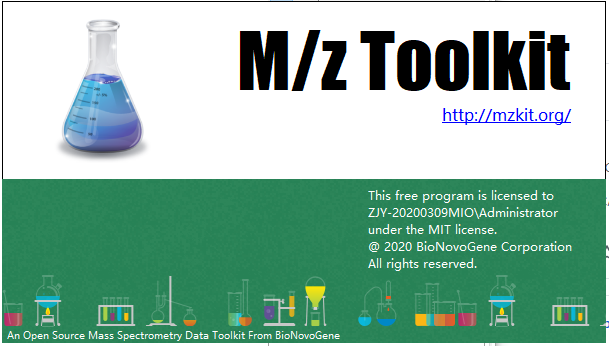
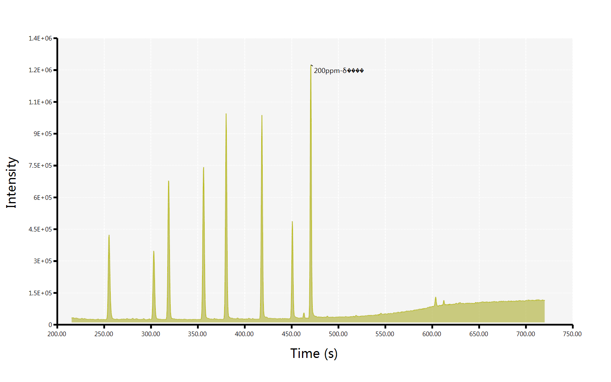
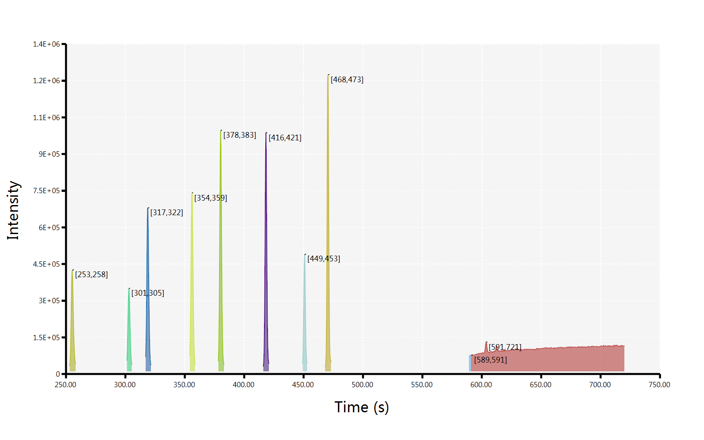

# BioNovoGene Mzkit






> GC/MS TIC and ROI plot


> MS/MS alignment for metabolite identification

```vbnet
Dim xlsx$ = "./ion-pairs.xlsx"
Dim ionPairs = Extensions.LoadIonPairs(xlsx, "ion pairs")

For Each file As String In ls - l - r - "*.mzML" <= directory
    Call ionPairs _
		.Plot(file) _
		.AsGDIImage _
		.SaveAs($"./{file.BaseName}.png")
Next
```

.png)


### Molecular Weight Calculator

Imports from project: https://omics.pnl.gov/software/molecular-weight-calculator-net-dll-version

VB.NET DLL version of the Molecular Weight Calculator, supporting a range of molecular weight calculations for both chemical formulas and amino acids. contains utility functions for calculating the molecular weight and percent composition of chemical formulas and amino acids. It recognizes user-definable abbreviations and custom elemental isotopes. It also includes a Mole/Mass Converter, Formula Finder, Capillary Flow Modeller, Amino Acid Notation Converter, Isotopic Distribution Calculator, and Peptide Sequence Fragmentation Modeler.

### Module Function

+ Spectra Prediction: Predicting the spectra for a given chemical structure. This task predicts low/10V, medium/20V, and high/40V energy MS/MS spectra for an input structure provided in SMILES or InChI format.
+ Peak Assignment: Annotating the peaks in set of spectra given a known chemical structure. This task takes a set of three input spectra (for ESI spectra, low/10V, medium/20V, and high/40V energy levels) or a single input spectra (for EI spectra, 70eV energy level) in peak list format and a chemical structure in SMILES or InChI format, then assigns a putative fragment annotation to the peaks in each spectrum.
