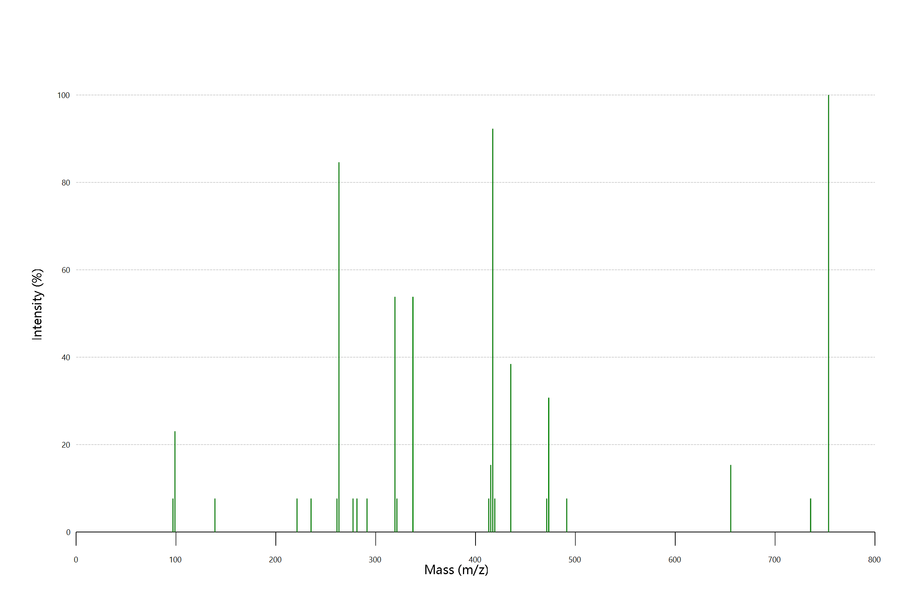

# spectrum

METLIN MS/MS spectrum data display



```vbnet
' Test code
Call Data.Load("./SpectrumChart/Spectrum.json") _
    .Data(Scan0) _
    .Plot(title:="H<sub>2</sub>O<sub>5</sub>C<sub>3</sub>Ag</br><span style=""color:blue; font-size:20"">Test MS/MS spectra plot</span>") _
    .SaveAs("./spectrum/Plot.png")
```

### Molecular Weight Calculator

Imports from project: https://omics.pnl.gov/software/molecular-weight-calculator-net-dll-version

VB.NET DLL version of the Molecular Weight Calculator, supporting a range of molecular weight calculations for both chemical formulas and amino acids. contains utility functions for calculating the molecular weight and percent composition of chemical formulas and amino acids. It recognizes user-definable abbreviations and custom elemental isotopes. It also includes a Mole/Mass Converter, Formula Finder, Capillary Flow Modeller, Amino Acid Notation Converter, Isotopic Distribution Calculator, and Peptide Sequence Fragmentation Modeler.