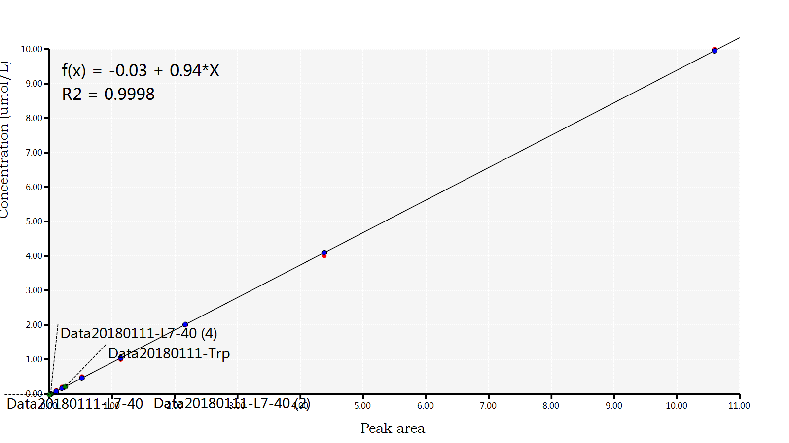

# The MRM data

The MRM is a kind of LCMS targetted quantify analysis method. One basic element in MRM is the ion data, ion data is consist with a ``precursor parent ion`` and ``product ion`` ion pair.

.png)

