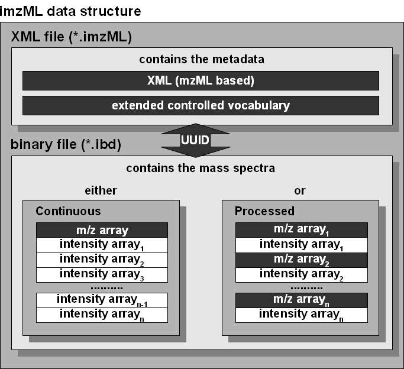
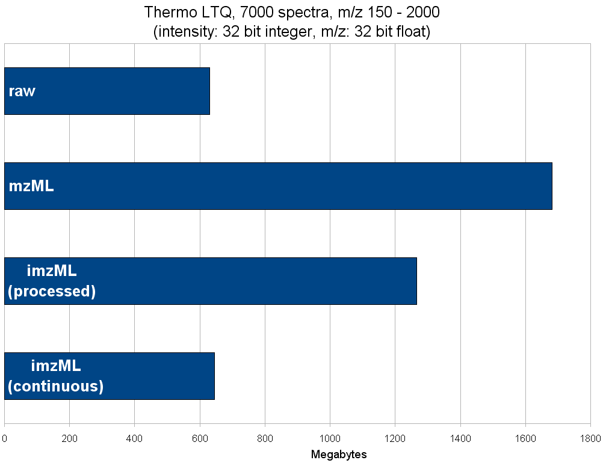

# general data structure of imzML
> https://ms-imaging.org/wp/imzml/data-structure/

imzML consists of two separate files: one for the metadata and one for the MS data. The metadata is saved in an XML 
file (*.imzML). The mass spectral data is saved in a binary file (*.ibd). The connection between the two files is 
made via links in the XML file which hold the offsets of the mass spectral data in the binary file. It is important 
to keep in mind that the information of both file is only valid if no file is missing. Therefore the user should be 
very careful when copying or moving those files; inaccurate file handling can result in data loss. It is recommend 
to keep the files in the same folder and use the same names for the imzML part and the ibd part.

Both files carry the same universally unique identifier (UUID). This can help to reunite lost files. The UUID is 
defined in the controlled vocabulary and this parameter is located in the imzML file in the fileContent tag. 
Comparing both UUIDs allows to find out if the two files build a pair of corresponding files.

## XML

The imzML file holds the metadata of a MS image which is described by the mzML based XML structure and the controlled 
vocabulary. The XML model of imzML is the same as for mzML (see the mzML version 1.1.0 documentation for further 
details). The controlled vocabulary was extended in order to include additional parameters which are needed to 
describe a MS imaging experiment.

There is only one XML element which differs slightly from the original mzML specification: The function of the binary 
tag was altered in such a way that it now contains no base64 encoded binary data. It stays empty, which is compatible 
to mzML 1.1.0. This results in predefined values for “encoded length” and “array length” of zero in the parent tags 
spectrum and binaryDataArray. Most of the changes in the XML part are related to cvParam mapping rules for the newly 
introduced parameters of the imaging controlled vocabulary. The XML part of imzML passes mzML validators without 
errors (the binary tag is empty).

## binary

The imaging binary data file (*.ibd) contains the mass spectral data. The first 16 bytes of the binary file are 
reserved for an Universally Unique Identifier. It is also saved in the imzML file so that a correct assignment of 
ibd and imzML file is possible even if the names of both files are different.

In order to insure efficient storage, two different formats of the binary data are defined: continuous and processed. 
Continuous type means that each spectrum of an image has the same m/z values. As a result the m/z array is only saved 
once directly behind the UUID of the file and the intensity arrays of the spectra are following. At the processed 
type every spectrum has its own m/z array. So it is necessary to save both – the m/z array and the corresponding 
intensity array – per spectrum.

Integer values may be stored as byte (1 byte), word (2 bytes), dword (4 bytes), long (8 bytes). Floating point values 
may be stored as single or double (cf. IEEE 754). The byte order is always little endian (intel style).

## file size

The efficient data storage of the imzML format is demonstrated by an example file consisting of 7000 spectra 
(50 x 35 pixels, 4 spectra per pixel).

Comparing the size of MS imaging files: The imzML (processed) file is about 30% smaller than the mzML file. The imzML 
(continuous) file is almost four times smaller than the mzML file and about the same size as the raw file.

The XML part ontaining the metadata is rather small compared to the size of the binary data file and is readable in 
a regular text editor.

## Universally unique identifier

Binary data can be stored in “little endian” or “big endian” (net standard) byte order. Mass spectral data in imzML 
binary files is stored in little endian byte order. The UUID (Universal Unique Identifier), however, is stored in 
big endian according to the RFC 4122 specifications (cf.).

Intel processors and clones use little endian, therefore integers in the computer memory are also little endian 
numbers. Depending on the programming language which is used, byte order may be automatically “corrected” when 
reading big endian UUIDs. But some widely used programming languages have no such automatic correction. So the 
programmer has to take care of this.

In the imzML binary file the first 16 bytes are the binary representation of the UUID. A hexadecimal viewer can be 
used to examine these bytes, for example: 52 33 F9 E6 09 B9 4A 00 AB 01 AF 5D F4 BE 38 15.

In the corresponding imzML file the textual version of the UUID which consists of 5 blocks delimited by a “-”-char 
is: 5233f9e6-09b9-4a00-ab01-af5df4be3815. Be aware that in a correct implementation, both representations should have 
the same sequence of hexadecimal numerals.

When implementing imzML on a Microsoft operating system, one will usually use the Microsoft implementation of 
UUID: GUID (General Unique Identifier). Its memory representation is defined by:

+ TGUID = structure
+ Data1: 4 byte unsigned integer;
+ Data2: 2 byte unsigned integer;
+ Data3: 2 byte unsigned integer;
+ Data4: array of 8 bytes;
+ end structure;

In this structure, Data1, Data2, and Data3 are numbers and therefore subject to byte order, whereas Data4 is just an 
array of 8 bytes (and thus independent of byte order). That means when dumping this memory representation on a little 
endian computer into a binary file Data1, Data2 and Data3 are inverted whereas Data4 is not inverted.