# [SMILES - A Simplified Chemical Language](https://www.daylight.com/dayhtml/doc/theory/theory.smiles.html)

SMILES (Simplified Molecular Input Line Entry System) is a line notation (a typographical method using printable characters) for entering and representing molecules and reactions. Some examples are:

| SMILES        | Name             | SMILES               | Name             |
|---------------|------------------|----------------------|------------------|
| ``CC``        | ethane           | ``[OH3+]``           | hydronium ion    |
| ``O=C=O``     | carbon dioxide   | ``[2H]O[2H]``        | deuterium oxide  |
| ``C#N``       | hydrogen cyanide | ``[235U]``           | uranium-235      |
| ``CCN(CC)CC`` | triethylamine    | ``F/C=C/F``          | E-difluoroethene |
| ``CC(=O)O``   | acetic acid      | ``F/C=C\F``          | Z-difluoroethene |
| ``C1CCCCC1``  | cyclohexane      | ``N[C@@H](C)C(=O)O`` | L-alanine        |
| ``c1ccccc1``  | benzene          | ``N[C@H](C)C(=O)O``  | D-alanine        |

| Reaction SMILES                          | Name                          |
|------------------------------------------|-------------------------------|
| ``[I-].[Na+].C=CCBr>>[Na+].[Br-].C=CCI`` | displacement reaction         |
| ``(C(=O)O).(OCC)>>(C(=O)OCC).(O)``       | intermolecular esterification |

SMILES contains the same information as might be found in an extended connection table. The primary reason SMILES is more useful than a connection table is that it is a linguistic construct, rather than a computer data structure. SMILES is a true language, albeit with a simple vocabulary (atom and bond symbols) and only a few grammar rules. SMILES representations of structure can in turn be used as "words" in the vocabulary of other languages designed for storage of chemical information (information about chemicals) and chemical intelligence (information about chemistry).

Part of the power of SMILES is that unique SMILES exist. With standard SMILES, the name of a molecule is synonymous with its structure; with unique SMILES, the name is universal. Anyone in the world who uses unique SMILES to name a molecule will choose the exact same name.

One other important property of SMILES is that it is quite compact compared to most other methods of representing structure. A typical SMILES will take 50% to 70% less space than an equivalent connection table, even binary connection tables. For example, a database of 23,137 structures, with an average of 20 atoms per structure, uses only 1.6 bytes per atom when represented with SMILES. In addition, ordinary compression of SMILES is extremely effective. The same database cited above was reduced to 27% of its original size by Ziv-Lempel compression (i.e. 0.42 bytes per atom).

These properties open many doors to the chemical information programmer. Examples of uses for SMILES are:

+ Keys for database access
+ Mechanism for researchers to exchange chemical information
+ Entry system for chemical data
+ Part of languages for artificial intelligence or expert systems in chemistry

The rest of this chapter is a concise exposition of the SMILES encoding rules. For further information, the reader is referred to "SMILES 1. Introduction and Encoding Rules", Weininger, D., J.Chem. Inf. Comput. Sci. 1988, 28,31.

## 3.1 Canonicalization

SMILES denotes a molecular structure as a graph with optional chiral indications. This is essentially the two-dimensional picture chemists draw to describe a molecule. SMILES describing only the labeled molecular graph (i.e. atoms and bonds, but no chiral or isotopic information) are known as generic SMILES. There are usually a large number of valid generic SMILES which represent a given structure. A canonicalization algorithm exists to generate one special generic SMILES among all valid possibilities; this special one is known as the "unique SMILES". SMILES written with isotopic and chiral specifications are collectively known as "isomeric SMILES". A unique isomeric SMILES is known as an "absolute SMILES". See the following examples.

| Input SMILES         | Unique SMILES    |
|----------------------|------------------|
| ``OCC``              | CCO              |
| ``[CH3][CH2][OH]``   | CCO              |
| ``C-C-O``            | CCO              |
| ``C(O)C``            | CCO              |
| ``OC(=O)C(Br)(Cl)N`` | NC(Cl)(Br)C(=O)O |
| ``ClC(Br)(N)C(=O)O`` | NC(Cl)(Br)C(=O)O |
| ``O=C(O)C(N)(Br)Cl`` | NC(Cl)(Br)C(=O)O |

## 3.2 SMILES Specification Rules

SMILES notation consists of a series of characters containing no spaces. Hydrogen atoms may be omitted (hydrogen-suppressed graphs) or included (hydrogen-complete graphs). Aromatic structures may be specified directly or in Kekulé form.
There are five generic SMILES encoding rules, corresponding to specification of atoms, bonds, branches, ring closures, and disconnections. Rules for specifying various kinds of isomerism are discussed in the following section, ISOMERIC SMILES.

## 3.2.1 Atoms

Atoms are represented by their atomic symbols: this is the only required use of letters in SMILES. Each non-hydrogen atom is specified independently by its atomic symbol enclosed in square brackets, [ ]. The second letter of two-character symbols must be entered in lower case. Elements in the "organic subset" B, C, N, O, P, S, F, Cl, Br, and I may be written without brackets if the number of attached hydrogens conforms to the lowest normal valence consistent with explicit bonds. "Lowest normal valences" are B (3), C (4), N (3,5), O (2), P (3,5), S (2,4,6), and 1 for the halogens. Atoms in aromatic rings are specified by lower case letters, e.g., aliphatic carbon is represented by the capital letter C, aromatic carbon by lower case c. Since attached hydrogens are implied in the absence of brackets, the following atomic symbols are valid SMILES notations.

|        |                   |           |
|--------|-------------------|-----------|
| **C**  | methane           | ``(CH4)`` |
| **P**  | phosphine         | ``(PH3)`` |
| **N**  | ammonia           | ``(NH3)`` |
| **S**  | hydrogen sulfide  | ``(H2S)`` |
| **O**  | water             | ``(H2O)`` |
| **Cl** | hydrochloric acid | ``(HCl)`` |

Atoms with valences other than "normal" and elements not in the "organic subset" must be described in brackets.

|          |                  |
|----------|------------------|
| ``[S]``  | elemental sulfur |
| ``[Au]`` | elemental gold   |

Within brackets, any attached hydrogens and formal charges must always be specified. The number of attached hydrogens is shown by the symbol H followed by an optional digit. Similarly, a formal charge is shown by one of the symbols + or -, followed by an optional digit. If unspecified, the number of attached hydrogens and charge are assumed to be zero for an atom inside brackets. Constructions of the form ``[Fe+++]`` are synonymous with the form ``[Fe+3]``. Examples are:

|            |                  |
|------------|------------------|
| ``[H+]``   | proton           |
| ``[Fe+2]`` | iron (II) cation |
| ``[OH-]``  | hydroxyl anion   |
| ``[Fe++]`` | iron (II) cation |
| ``[OH3+]`` | hydronium cation |
| ``[NH4+]`` | ammonium cation  |

### 3.2.2 Bonds

Single, double, triple, and aromatic bonds are represented by the symbols -, =, #, and :, respectively. Adjacent atoms are assumed to be connected to each other by a single or aromatic bond (single and aromatic bonds may always be omitted). Examples are:

|            |                    |            |
|------------|--------------------|------------|
| ``CC``     | ethane             | (CH3CH3)   |
| ``C=O``    | formaldehyde       | (CH2O)     |
| ``C=C``    | ethene             | (CH2=CH2)  |
| ``O=C=O``  | carbon dioxide     | (CO2)      |
| ``COC``    | dimethyl ether     | (CH3OCH3)  |
| ``C#N``    | hydrogen cyanide   | (HCN)      |
| ``CCO``    | ethanol            | (CH3CH2OH) |
| ``[H][H]`` | molecular hydrogen | (H2)       |

For linear structures, SMILES notation corresponds to conventional diagrammatic notation except that hydrogens and single bonds are generally omitted. For example, 6-hydroxy-1,4-hexadiene can be represented by many equally valid SMILES, including the following three:

| Structure               | Valid SMILES  |
|-------------------------|---------------|
|                         | C=CCC=CCO     |
| CH2=CH-CH2-CH=CH-CH2-OH | C=C-C-C=C-C-O |
|                         | OCC=CCC=C     |

### 3.2.3 Branches

Branches are specified by enclosing them in parentheses, and can be nested or stacked. In all cases, the implicit connection to a parenthesized expression (a "branch") is to the left. Examples are:

| 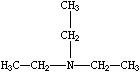 | 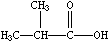 |                                | 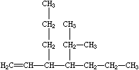 |
|-------------------------|-------------------------|--------------------------------|-------------------------|
| CCN(CC)CC               | CC(C)C(=O)O             | C=CC(CCC)C(C(C)C)CCC           |                         |
| Triethylamine           | Isobutyric acid         | 3-propyl-4-isopropyl-1-heptene |                         |

### 3.2.4 Cyclic Structures

Cyclic structures are represented by breaking one bond in each ring. The bonds are numbered in any order, designating ring opening (or ring closure) bonds by a digit immediately following the atomic symbol at each ring closure. This leaves a connected non-cyclic graph which is written as a non-cyclic structure using the three rules described above. Cyclohexane is a typical example:


There are usually many different, but equally valid descriptions of the same structure, e.g., the following SMILES notations for 1-methyl-3-bromo-cyclohexene-1:

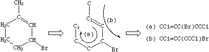

Many other notations may be written for the same structure, deriving from different ring closures. SMILES does not have a preferred entry on input; although (a) above may be simplest, others are just as valid.

A single atom may have more than one ring closure. This is illustrated by the structure of cubane in which two atoms have more than one ring closure:

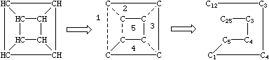

Generation of SMILES for cubane: ``C12C3C4C1C5C4C3C25``.

If desired, digits denoting ring closures can be reused. As an example, the digit 1 used twice in the specification:

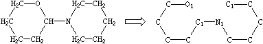
> O1CCCCC1N1CCCCC1

The ability to re-use ring closure digits makes it possible to specify structures with 10 or more rings. Structures that require more than 10 ring closures to be open at once are exceedingly rare. If necessary or desired, higher-numbered ring closures may be specified by prefacing a two-digit number with percent sign (``%``). For example, ``C2%13%24`` is a carbon atom with a ring closures 2, 13, and 24 .

### 3.2.5 Disconnected Structures

Disconnected compounds are written as individual structures separated by a "``.``" (period). The order in which ions or ligands are listed is arbitrary. There is no implied pairing of one charge with another, nor is it necessary to have a net zero charge. If desired, the SMILES of one ion may be imbedded within another as shown in the example of sodium phenoxide.

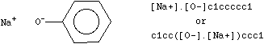

Matching pairs of digits following atom specifications imply that the atoms are bonded to each other. The bond may be explicit (bond symbol and/or direction preceding the ring closure digit) or implicit (a nondirectional single or aromatic bond). This is true whether or not the bond ends up as part of a ring.

Adjacent atoms separated by dot (.) implies that the atoms are not bonded to each other. This is true whether or not the atoms are in the same connected component.

For example, ``C1.C1`` specifies the same molecule as ``CC``(ethane)

## 3.3 Isomeric SMILES

This section describes the SMILES rules used to specify isotopism, configuration about double bonds, and chirality. The term isomeric SMILES collectively refers to SMILES written using these rules.

The SMILES isomer specification rules allow chirality to be completely specified for any structure, if it is known. Unlike most existing chemical nomenclatures such as CIP and IUPAC, these rules are also designed to allow rigorous partial specification of chirality. Aside from use in macros, substructure searching, and other pattern matching operations, this is important because much of the world's available chemical information is known for structures with incompletely resolved chiralities (not all possible chiral centers are separated, known, or reported).

All isomer specification rules in SMILES are therefore optional. The absence of a specification for any attribute implies that the value of that attribute is unspecified.

### 3.3.1 Isotopic Specification

Isotopic specifications are indicated by preceding the atomic symbol with a number equal to the desired integral atomic mass. An atomic mass can only be specified inside brackets. For instance:

| Smiles  | Name                      |
|---------|---------------------------|
| [12C]   | carbon-12                 |
| [13C]   | carbon-13                 |
| [C]     | carbon (unspecified mass) |
| [13CH4] | C-13 methane              |

### 3.3.2 Configuration Around Double Bonds

Configuration around double bonds is specified by the characters ``/`` and ``\`` which are "directional bonds" and can be thought of as kinds of single or aromatic (eg. default) bonds. These symbols indicate relative directionality between the connected atoms, and have meaning only when they occur on both atoms which are double bonded. For instance, the following SMILES are all valid for ``E-`` and ``Z-1,2-difluoroethene``:

| 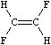 | 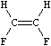 |
|-------------------------|--------------------------|
| F/C=C/F                 | F/C=C\F                  |
| F\C=C\F                 | F\C=C/F                  |

An important difference between SMILES chirality conventions and others such as CIP is that SMILES uses local chirality representation (as opposed to absolute chirality), which allows partial specifications. An example of this is illustrated below:

| 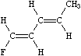 | 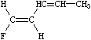 |
|--------------------------|--------------------------|
| F/C=C/C=C/C              | F/C=C/C=CC               |
| (completely specified)   | (partially specified)    |

### 3.3.3. Configuration Around Tetrahedral Centers

SMILES uses a very general type of chirality specification based on local chirality. Instead of using a rule-based numbering scheme to order neighbor atoms of a chiral center, orientations are based on the order in which neighbors occur in the SMILES string. As with all other aspects of SMILES, any valid order is acceptable; the Daylight software is responsible for retaining the meaning of the chiral specification when the structure is modified or rearranged (e.g. to make the unique SMILES).

The simplest and most common kind of chirality is tetrahedral; four neighbor atoms are evenly arranged about a central atom, known as the "chiral center". If all four neighbors are different from each other in any way, mirror images of the structure will not be identical. The two mirror images are known as "enantiomers" and are the only two forms that a tetrahedral center can have. If two (or more) of the four neighbors are identical to each other, the central atom will not be chiral (its mirror images can be superimposed in space).

In SMILES, tetrahedral centers may be indicated by a simplified chiral specification (@ or @@) written as an atomic property following the atomic symbol of the chiral atom. If a chiral specification is not present for a chiral atom, its chirality is implicitly not specified. For instance:

| 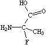 | 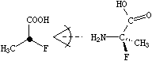 |
|--------------------------|--------------------------|
| ``NC(C)(F)C(=O)O``       | ``N[C@](C)(F)C(=O)O``    |
| ``NC(F)(C)C(=O)O``       | ``N[C@@](F)(C)C(=O)O``   |
| (unspecified chirality)  | (specified chirality)    |

Looking from the amino N to the chiral C (as the SMILES is written), the three other neighbors appear anticlockwise in the order that they are written in the top SMILES, ``N[C@](C)(F)C(=O)O`` (methyl-C, F, carboxy-C), and clockwise in the bottom one, ``N[C@@](F)(C)C(=O)O``. The symbol "``@``" indicates that the following neighbors are listed anticlockwise (it is a "visual mnemonic" in that the symbol looks like an anticlockwise spiral around a central circle). "``@@``" indicates that the neighbors are listed clockwise (you guessed it, anti-anti-clockwise).

If the central carbon is not the very first atom in the SMILES and has an implicit hydrogen attached (it can have at most one and still be chiral), the implicit hydrogen is taken to be the first neighbor atom of the three neighbors that follow a tetrahedral specification. If the central carbon is first in the SMILES, the implicit hydrogen is taken to be the "from" atom. Hydrogens may always be written explicitly (as ``[H]``) in which case they are treated like any other atom. In each case, the implied order is exactly as written in SMILES. Some of the valid SMILES for the alanine are:

| 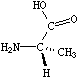 | 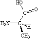 |
|--------------------------|--------------------------|
| ``N[C@@]([H])(C)C(=O)O`` | ``N[C@]([H])(C)C(=O)O``  |
| ``N[C@@H](C)C(=O)O``     | ``N[C@H](C)C(=O)O``      |
| ``N[C@H](C(=O)O)C``      | ``N[C@@H](C(=O)O)C``     |
| ``[H][C@](N)(C)C(=O)O``  | ``[H][C@@](N)(C)C(=O)O`` |
| ``[C@H](N)(C)C(=O)O``    | ``[C@@H](N)(C)C(=O)O``   |

The chiral order of the ring closure bond is implied by the lexical order that the ring closure digit appears on the chiral atom (not in the lexical order of the "substituent" atom).

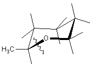 
> ``C[C@H]1CCCCO1`` or ``O1CCCC[C@@H]1C``

### 3.3.4 General Chiral Specification

There are many kinds of chirality other than tetrahedral. The use of the "@" symbol described above is actually a special case of a general chiral specification syntax.

The general chiral specification used in SMILES has three parts: the @ symbol, followed by a two-letter chiral class indicator, followed by a numerical chiral permutation designator. A default chiral class is assigned to each degree (number of connections); the default class for four connections is tetrahedral (TH). Most chiralities have more than two possible choices; the choices are assigned from a table numerically. In most cases, the @1 designation means "anticlockwise around the axis represented by SMILES order" and @2 means "clockwise". Notations in the form "``@@``" and "``@@@``" are interpreted as "``@2``" and "``@3``" (analogous to "+++" meaning "+3"). The "``@``" and "``@@``" notations used above are shortcuts for the full specifications "``@TH1``" and "``@TH2``". In practice, full chiral specifications are not often needed.

SMILES handles the full range of chiral specification, including resolution of "reduced chirality" (where the number of enantiomers is reduced by symmetry) and "degenerate chirality" (where the center becomes non-chiral due to symmetrical substitution). As with other aspects of SMILES, the language guarantees the ability to specify exactly what is known, including partial specifications. The SMILES system will generate unique isomeric SMILES for any given specification, and substructure recognition will operate correctly on all types of chirality.

The rest of this section will be limited to discussing the following chiralities: tetrahedral, allene-like, square-planar, trigonal-bipyramidal, and octahedral. Although many more chiral classes can be handled by this system (it's table-driven), these five classes are very common in chemistry and cover most of the issues to be encountered in the remainder.

Tetrahedral. The tetrahedral class symbol is TH. This is the default chiral class for degree four. Possible values are 1 and 2. @TH1 (or just @) indicates that, looking from the first connected atom, the following three connected atoms are listed anticlockwise; @TH2 (or @@) indicates clockwise.

Allene-like. The allene-like class symbol is AL. This is the default chiral class for degree 2 (the chiral center is the central atom with two double bonds). Although substituted C=C=C structures are most common, ``C=C=C=C=C`` structures are also allene-like, as are any odd number of serially double-bonded atoms. Possible values are @AL1 (or just @) and @AL2 (or @@); these are interpreted by superimposing the substituted atoms and evaluating as per tetrahedral. Hydrogens attached to substituted allene-like atoms are taken to be immediately following that atom, as shown below:

|  | 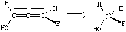    |
|--------------------------|-----------------------------|
| ``OC(Cl)=[C@]=C(C)F``    | ``OC=[C@]=CF``              |
| ``OC(Cl)=[C@AL1]=C(C)F`` | ``OC([H])=[C@AL1]=C([H])F`` |

Square-planar. The square-planar class symbol is SP Possible values are @SP1, @SP2, and @SP3; this is not the default chiral class for degree four, so shorthand specifications are not allowed. Square-planar is also somewhat unusual in that the ideas of clockwise and anticlockwise do not apply.

| 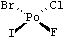 |                            |
|--------------------------|----------------------------|
| ``F[Po@SP1](Cl)(Br)I``   | (SP1 lists in a "U shape") |
| ``F[Po@SP2](Br)(Cl)I``   | (SP2 lists in a "4-shape") |
| ``F[Po@SP3](Cl)(I)Br``   | (SP3 lists in a "Z shape") |

Trigonal-bipyramidal. The trigonal-bipyramidal class symbol is TB. This is the default chiral class for degree five. Possible values are @TB1 to @TB20. @TB1 (or just @) indicates that, when the SMILES is listed from one axial connection to the other, the three intermediate, equatorially-connected atoms are listed anticlockwise; @TB2 (or @@) indicates clockwise. This is illustrated below.

| 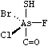  |
|---------------------------|
| ``s[As@@](F)(Cl)(Br)C=O`` |
| ``O=C[As@](F)(Cl)(Br)S``  |

Octahedral. The octahedral class symbol is OH. This is the default chiral class for degree six. Possible values are @OH1 to @OH30. @OH1 (or just @) indicates that, when the SMILES is listed from one axial connection to the other, the four intermediate, equatorially-connected atoms are listed anticlockwise; @OH2 (or @@) indicates clockwise. This is illustrated below.

| 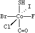     |
|------------------------------|
| ``S[Co@@](F)(Cl)(Br)(I)C=O`` |
| ``O=C[Co@](F)(Cl)(Br)(I)S``  |

## 3.4 SMILES Conventions

Aside from the above rules, a small number of conventions are universally used in SMILES. These are briefly discussed below; for more detail, see the JCICS paper (ibid).

### 3.4.1 Hydrogens

Hydrogen atoms do not normally need to be specified when writing SMILES for most organic structures. The presence of hydrogens may be specified in three ways:

+ Implicitly.....for atoms specified without brackets, from normal valence assumptions.
+ Explicitly by count.....inside brackets, by the hydrogen count supplied; zero if unspecified.
+ As explicit atoms.....as ``[H]`` atoms.

There is no distinction between "organic" and "inorganic" SMILES nomenclature. One may specify the number of attached hydrogens for any atom in any SMILES. For example, propane may be entered as ``[CH3][CH2][CH3]`` instead of ``CCC``.

There are four situations where specification of explicit hydrogen specification is required:

+ charged hydrogen, i.e. a proton, ``[H+]``;
+ hydrogens connected to other hydrogens, e.g., molecular hydrogen, ``[H][H]``;
+ hydrogens connected to other than one other atom, e.g., bridging hydrogens; and
+ isotopic hydrogen specifications, e.g. in heavy water, ``[2H]O[2H]``.

### 3.4.2 Aromaticity

Aromaticity must be deduced in a system such as SMILES which generates an unambiguous chemical nomenclature because of the fundamental requirement to characterize the symmetry of a molecule. Given effective aromaticity-detection algorithms, it is not necessary to enter any structure as aromatic if the user prefers to enter an aliphatic (Kekulé-like) structure. Entering structures as aromatic directly (i.e., by using lower case atomic symbols) provides a shortcut to accurate chemical specification and is closer to the mental molecular model used by most chemists.
The SMILES algorithm uses an extended version of Hueckel's rule to identify aromatic molecules and ions. To qualify as aromatic, all atoms in the ring must be sp2 hybridized and the number of available "excess" p-electrons must satisfy Hueckel's 4N+2 criterion. As an example, benzene is written c1ccccc1, but an entry of C1=CC=CC=C1 - cyclohexatriene, the Kekulé form - leads to detection of aromaticity and results in an internal structural conversion to aromatic representation. Conversely, entries of c1ccc1 and c1ccccccc1 will produce the correct anti-aromatic structures for cyclobutadiene and cyclooctatetraene, C1=CC=C1 and C1=CC=CC=CC=C1. In such cases the SMILES system looks for a structure that preserves the implied sp2 hybridization, the implied hydrogen count, and the specified formal charge, if any. Some inputs, however, may not only be incorrect but also impossible, such as c1cccc1. Here c1cccc1 cannot be converted to C1=CCC=C1 since one of the carbon atoms would be sp3 with two attached hydrogens. In such a structure alternating single and double bond assignments cannot be made. The SMILES system will flag this as an "impossible" input. Please note that only atoms on the following list can be considered aromatic: C, N, O, P, S, As, Se, and * (wildcard). In addition, exocyclic double bonds do not break aromaticity.

| 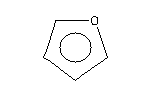 | 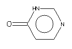 | 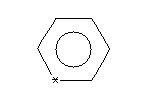 |
|--------------------------|--------------------------|--------------------------|
| ``C1=COC=C1``            | ``C1=CN=C[NH]C(=O)1``    | ``C1=C*=CC=C1``          |
| ``c1cocc1``              | ``c1cnc[nH]c(=O)1``      | ``c1c*ccc1``             |

It is important to remember that the purpose of the SMILES aromaticity detection algorithm is for the purposes of chemical information representation only! To this end, rigorous rules are provided for determining the "aromaticity" of charged, heterocyclic, and electron-deficient ring systems. The "aromaticity" designation as used here is not intended to imply anything about the reactivity, magnetic resonance spectra, heat of formation, or odor of substances.

### 3.4.3 Aromatic Nitrogen Compounds

A short note is in order about aromatic nitrogens, a common source of confusion in chemical information systems. All three common types of aromatic nitrogen may be specified with the aromatic nitrogen symbol n. Archetypical examples are pyridine, pyridine-N-oxide, and pyrrole.

| 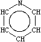 | 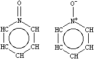             | 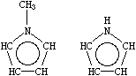       |
|--------------------------|--------------------------------------|--------------------------------|
| ``n1ccccc1``             | ``O=n1ccccc1``   ``[O-][n+]1ccccc1`` | ``Cn1cccc1``    ``[nH]1cccc1`` |
| Pyridine                 | Pyridine-N-oxide                     | Methyl and 1H-pyrrole          |

Note that the pyrrolyl nitrogen in 1H-pyrrole is written ``[nH]`` to distinguish this kind of nitrogen from a pyridyl-N. Alternative valid SMILES for 1H-pyrrole include ``[H]n1cccc1`` (with explicit hydrogen) and ``N1C=CC=C1`` (aliphatic form) all three input forms are equivalent.

### 3.4.4 Bonding Conventions

SMILES does not dictate which valence conventions should be used to model molecular structure. In fact, an advantage of using SMILES is its ability to describe various valence models of the same structure. Atoms may be connected and show charge separation as desired. For instance, nitromethane can be represented in SMILES as ``CN(=O)=O`` or as the charge separated ``C[N+](=O)[O-]`` (we tend to use the former for database work because it preserves symmetry). Both are "right" in the sense that they represent different, useful models of the substance. In general, when symmetry is not an issue, most chemists prefer charge-separated structures if they can avoid representing atoms in unusual valence states, e.g., diazomethane is written as ``C=[N+]=[N-]`` rather than ``C=[N]=[N]``.

Given one valence model of a structure, chemical database systems such as THOR and Merlin have the ability to retrieve data about that structure even if the data were stored under a different valence model of the structure. With such systems, the choice of valence conventions is not critical to either database design nor database query.

### 3.4.5 Tautomers

Tautomeric structures are explicitly specified in SMILES. There are no "tautomeric bond", "mobile hydrogen", nor "mobile charge" specifications. Selection of one or all tautomeric structures is left to the user and strongly depends on the application. Given one tautomeric form, most chemical information systems will report data for all known tautomers if needed. The role of SMILES is to specify exactly which tautomeric form is requested, and for which there are data. A simple example, with two possible tautomeric forms, is shown below:

| 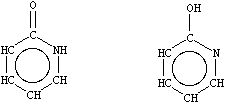                  |
|-------------------------------------------|
| ``O=c1[nH]cccc1             Oc1ncccc1``   |
| ``2-pyridone                2-pyridinol`` |

## 3.5 Extensions for Reactions

The SMILES language is extended to handle reactions. There are two areas where SMILES is extended: distinguishing component parts of a reactions and atom maps.

Component parts of a reaction are handled by introducing the ">" character as a new separator. Any reaction must have exactly two > characters in it. ">>" is a valid reaction SMILES for an empty reaction. Each of the ">"-separated components of a reaction must be a valid molecule SMILES.

As an aside, molecule SMILES never have a ">" character. In a program, one can quickly determine if a SMILES refers to a reaction or molecule by searching for a ">" character in the string.

```text
reaction      :   reactant '>' agent '>' product
              |   reactant '>>' product
              ;
reactant,
agent,
product       :   molecule
              |   <null>
              ;
molecule      :   SMILES
              ;
```

> Reaction SMILES Grammar

SMILES:  a valid molecule specification in the SMILES language.

For example:

+ ``C=CCBr>>C=CCI``
This is a valid reaction. Note that there are no agent molecules. Also note that several atoms are missing from the reaction (the product "Br" and the reactant "F").

+ ``[I-].[Na+].C=CCBr>>[Na+].[Br-].C=CCI``
This is a more complete version of the same reaction. It has been canonicalized. It would form the root of a datatree when stored in a THOR database.

+ ``C=CCBr.[Na+].[I-]>CC(=O)C>C=CCI.[Na+].[Br-]``
This version of the reaction includes an agent. Note that the SMILES does not indicate how the agent participates. Whether the agent is a solvent, catalyst, or performs another function within the reaction must be stored separately as data. This SMILES could be stored in a THOR database as an absolute SMILES and would appear on the same datatree page as the previous example.

In the above example, note that the reaction is ambiguous with respect to the carbon atoms involved. One might assume that a normal Sn2 displacement is occurring. In fact, an equally reasonable allylic displacement is possible, via either an Sn1-like allyl cation. Recognize that the reaction SMILES given above do not say which carbons are which and hence do not discriminate between the two alternate mechanisms.

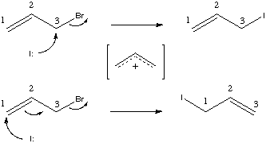

This case demonstrates the use and need for atom maps for reaction processing. Atom maps are used primarily to further define the overall reaction in cases where the reaction mechanism may not be evident from the reactant and product molecules. Atom maps are non-negative integer atom modifiers. They follow the ":" character within an atom expression. They must be the last modifier within the atom expression:

```text
atom        :   SYMBOL
            |   [ WEIGHT SYMBOL mods ]
            |   [ WEIGHT SYMBOL mods : CLASS ]
            ;
mods        :   mod mods
            ;
mod         :   HCOUNT | CHARGE | CHIRAL
            ;
```

> SMILES Atom Expression Grammar

+ ``CLASS``  = non-negative integer class value.
+ ``WEIGHT`` = atomic weight.
+ ``SYMBOL`` = atomic symbol.
+ ``HCOUNT`` = Atom hydrogen count specification.
+ ``CHARGE`` = Atom charge specification.
+ ``CHIRAL`` = Atom chirality specification.

Atom maps are an atomic property. They can legally appear in a SMILES for any atom, whether or not it is part of a reaction. Atom with atom map labels in a molecule SMILES are considered valid; the atom maps are ignored for molecule processing. Absolute and unique SMILES generated by the system for molecules never include atom maps.

Finally, there are some differences in the handling of atom maps and agent components in the unique versus absolute SMILES for reactions. Atom maps and agent components are not part of the unique SMILES specification. This is important for the THOR database, where the datatree roots are formed from the unique SMILES. The net result is that each reaction datatree may contain multiple specific reactions with different agents and atom maps.

### 3.5.1 Reaction Atom Maps

Atom mappings are properties of the atoms in the reaction molecules. The mappings represent equivalence classes of atoms within a reaction. In effect, the map tells the computer which atoms are the same on the reactant and products sides of a reaction. Without this map information, it is difficult to derive the reaction bond changes which occur.

Within the SMILES language, atom maps are represented as a non-negative numeric atom modifier following the ":" character (e.g. ``[CH3:2]`` is a carbon in class 2).

Within the Daylight toolkit, the atom maps are manipulated as sets of mapped atoms. The atom map class numbers which are used in SMILES do not appear in the toolkit interface to a reaction. The map class numbers in SMILES do not have any additional significance, except to associate all atoms with the same map class label to one another.

There are no requirements for completeness or uniqueness of the atom mappings. Atom mappings are independent of the connectivity and properties of the underlying molecules. This is so for several reasons: first, there are limits to the valence representation of molecules which appear when processing reactions. For example the oxygens in sodium acetate ``(CC(=O)[O-].[Na+])`` are chemically indistinguishable, even though the valence model used in the toolkit requires that they be connected differently. Some systems (CAS, for example) recognize this equivalence in their structural representation (the tautomer bond). It is often useful to map these to the same class for reaction purposes: ``[CH3:1][C:2](=[O:3])[O-:3].[Na+:4]``

A second case is where there is ambiguity in a reaction mechanism which one wants to express:

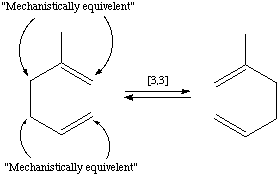

can undergo a cope rearrangement before reaction (which yields the same molecule graph). In effect, there are two distinct mechanisms by which the product is produced. This can be expressed as part of a reaction by: ``[CH2:1]=[CH:2][CH2:1][CH2:3][C:4](C)[CH2:3]``

A third case is simply a lack of information about the reaction itself. It should be possible to omit some atom maps or specify partial information for sets of atoms which ``*might*`` end up in a given position in the product. It is never acceptable to force a user to make up data in order to register a reaction. One should only store exactly what is known about the reaction. Atom maps are, by definition ambiguous with respect to the underlying molecules. Atom maps do not appear in the lexical representation of a unique SMILES. They do appear in the lexical representation of an absolute SMILES.

Finally, atom maps are arbitrary class designations; the values of the numbers have no meaning. The Daylight system reserves the right to change the class numbers upon canonicalization of a reaction. The system will reorder the atom map classes over the entire reaction during canonicalization. The resulting maps are guaranteed to have the same meaning as the reaction before canonicalization. Practically, the maps are renumbered as small, dense integers in canonical atom order, but this is not guaranteed. Also, during canonicalization, the atom map classes for agent atoms are removed.

### 3.5.2 Hydrogens

Hydrogens in reactions are handled as with molecules; they are suppressed unless "special". Recall that for molecules, hydrogens are special if they are: charged, isotopic, bonded to another hydrogen, or multiply bonded. With reactions, there is an additional case which will make a hydrogen special. It is often desirable (eg. 1,5-hydride shift) to store information about the location of hydrogens as part of the atom map of a reaction. Hydrogens with a supplied atom map are considered "special" and these hydrogens are not suppressed. These mapped hydrogens appear explicitly in Absolute SMILES for reactions. Otherwise, atom-mapped hydrogens do not appear in Unique SMILES.

## 3.6 Acknowledgments

Development of SMILES was initiated by the author, David Weininger, at the Environmental Research Laboratory, U.S.E.P.A., Duluth, MN; the design was completed at Pomona College in Claremont, CA. It was embodied in the Daylight Toolkit with the assistance of Cedar River Software.
