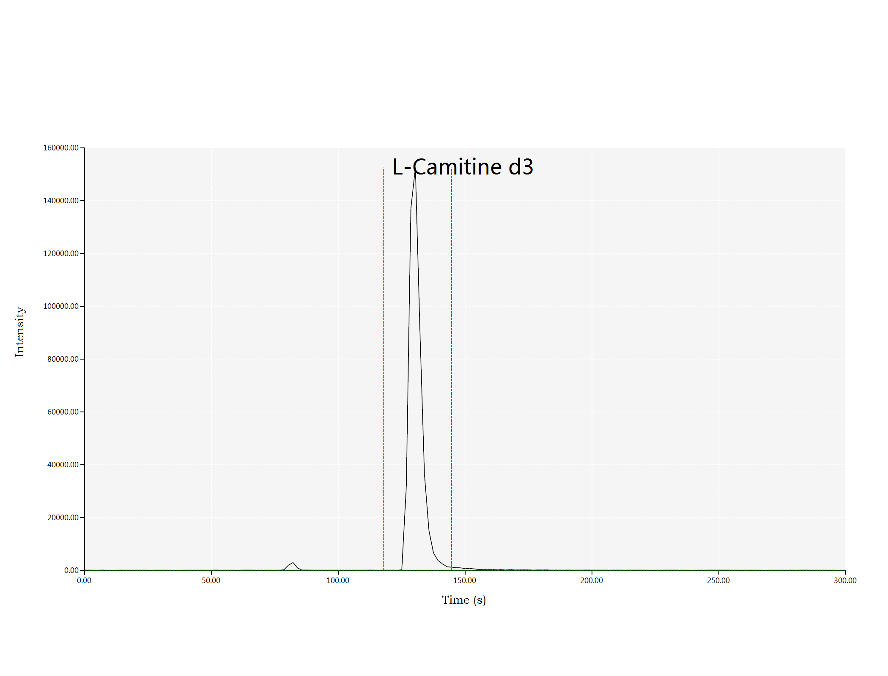
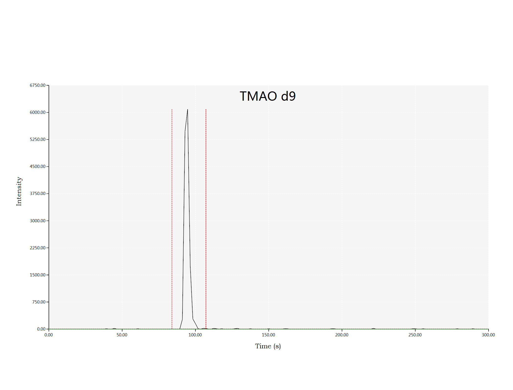
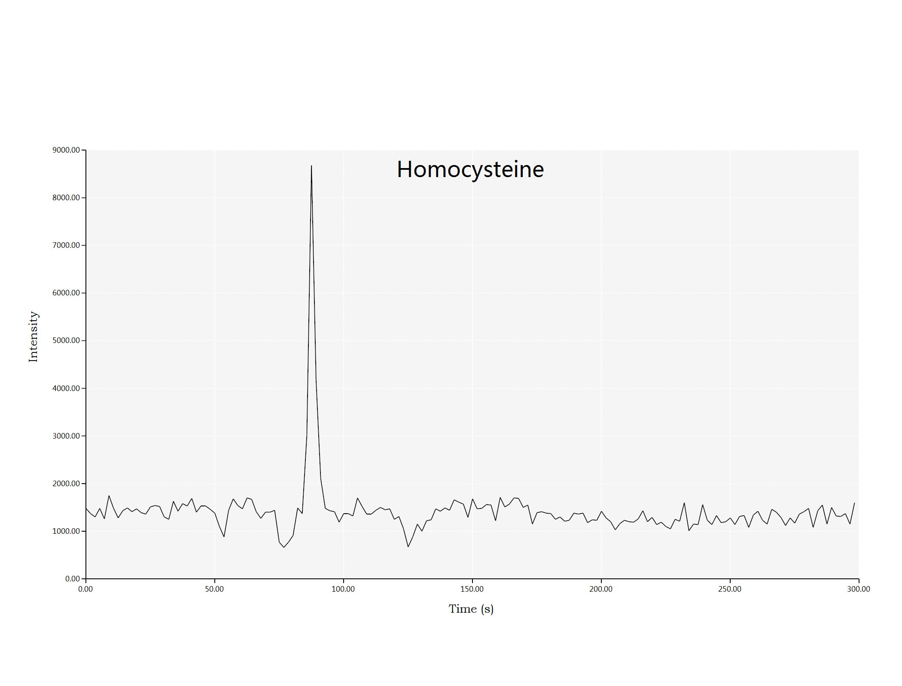
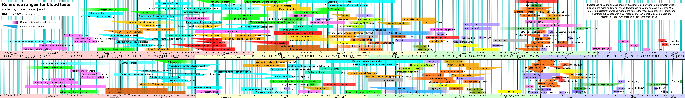

## Visualize Peak Finding

Finding the ion peak for MRM chromatogram data with baseline quantile cutoff 0.65, peak threshold 45 degree and windows size equals to 5.

> The red dash line is the peak left/right boundary, and the green dash line is the signal baseline. 

> Correlation heatmap of serum metabolite measures quantified by the high-throughput NMR metabolomics platform. Color coding indicates Spearman's correlation coefficients in the FINRISK study(n=7256). The correlation structure of the metabolites was similar in the other cohorts.

> https://en.wikipedia.org/wiki/Reference_ranges_for_blood_tests